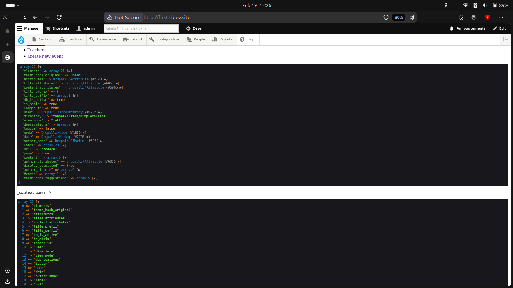

# Creating a custom theme

### Setting up

To create a custom theme we need to follow the below process

1. In project directory create new folder under `web/themes/custom/` name it.
2. Under it **.info.yml** file is created such a way project detects the theme.
        The file contains

```yml
name: Simple college theme                          # Name of the theme
type: theme                                         # Type representing as theme
description: "A test theme for my college website"  # A simple description
core_version_requirement: ^9 || ^10 || ^11          # The version on drupal core required
core: ^10                                           # Best works on which drupal version
base theme: stark                                   # This theme depends on which theme
```


### Adding regions to block layout

now it is time to add the regions to the theme just like above create new pair like below
```yml
regions:
    NAME: VALUE
    NAME1: VALUE1
```
and so on.

Flush the cache and enable all the disabled blocks from the block layout menu.

Changes the regions accordingly to our website needs


---

Now our new regions are visible in the Block Layout menu.


Then I cloned a **./templates/page.html.twig** file from the inbuilt theme and made some changes to display our all regions defined in our **.info.yml** file.


<!--
### Adding libraries

1. Define asset library in <em>.libraries.yml</em>.
2. Declare assets into **.info.yml** using libraries key.
3. Reference as needed in *.css* and *.html.twig* files.
 -->
---

 ### Pipeline


---
### Overriding the settings

To override the default **settings.php** file from **web/sites/default/settings.php** we need to create the **settings.local.php** file in the same directory and load it at the very bottom of our main **settings.php** file such a way it takes full effect and nothing gets overriden by default settings.

```php
if (file_exists($app_root . '/' . $site_path . '/settings.local.php')) {
  include $app_root . '/' . $site_path . '/settings.local.php';
}
```

and from that local php settings file uncomment the **Disable the render cache.** and **Disable Dynamic Page Cache.** such a way page directly gets loaded from HTML twig files and not from the cache. <br>
In short there is no need to **Flush cache** every time we make changes to the codebase.


### Overriding services.yml

Similarly **web/sites/default/default.services.yml** file gets overriden by **web/sites/development.services.yml** so we can add properties to this file such a way defaults gets overriden.

added below lines

```yml
parameters:
  twig.config:
    debug: true # outputs some extram markup along with each twig template also we can use inspect option
    auto_reload: true
    cache: false
```


Render caching disabled and twig debug mode enabled.

At final rebuild the cache from now on there is no need of the same.


---

### Fields in the theme

Create **theme-settings.php** file in the **custom/simplecollege** folder.

Adds a section "Simple College Theme Settings" in the Appearance → Theme Settings page.
Creates:

    Checkbox for enabling a custom logo.
    Text field for a custom footer message.

Saves the settings when the form is submitted.

before it was like below having default fields for our custom theme.


and now we can see two new options are there which we have added to the php file.


We need hooks for the implementation of the same.


### Inspecting variables.
kint() from devel or dump() from php is used to display the variables in the node.html.twig file.

1. {{ dump() }}
2. {{ dump(title_suffix) }}# Prints info about specific section.
3. {{ kint(_context|keys) }} # prints only the keys.




Views theming


|Section| template | info |
|--|--|--|
| Wrapper | views-view.html.twig | This section represents the view's wrapper template.|
| Format | views-view-FORMAT.html.twig | This section represents the view's format template. (replace by the machine name of format *eg.table, grid, list*) |
| Row style (show) | views-view-fields.html.twig | Reperesents individual row depends on the chosen format |
| Field |  	views-view-field.html.twig  | Reperesents individual field on the screen |

can be found at `web/core/modules/views/templates`

**{template name}--{view-name}--{display-id}--{field-id}.html.twig**


### Overriding the views template file

In the templates folder of my custom theme I've created new file **views-view--students_list.html.twig** for overriding the view of the students list page.
And tweaked some things here and there. and then flushed the cache.

### Custom fields fix

I've added new 3rd field in the simplecollege themes settings page for changing the background of the webpage or block rendered on the screen as well nothin gwas being applied at all so I've created a file **simplecollege.theme** which Implementing the hooks to deliver the data between those settings changes and actual webpage (twig file).

So basically the steps to add any field to the Themes settings include.

1. In the themes info.yml file add below section (PS I have 3 fields so three)
```yml
settings:
  custom-theme-settings: true
  custom_footer_text: 'Default Footer Text'
  custom_bg_color: '#FFFFFF'
  enable_dark_mode: false
```

2. In the **theme-settings.php** file add the code to display those options in the theme's settings page
```php
<?php
use Drupal\Core\Form\FormStateInterface;
/**
 * Implements hook_form_system_theme_settings_alter().
 */
function simplecollege_form_system_theme_settings_alter(&$form, FormStateInterface $form_state) {
  // Create a section for Simple College theme settings.
  $form['simplecollege_settings'] = [
    '#type' => 'details',
    '#title' => t('Simple College Theme Settings'),
    '#open' => TRUE,
  ];
  // Checkbox to enable custom logo.
  $form['simplecollege_settings']['custom_logo'] = [
    '#type' => 'checkbox',
    '#title' => t('Enable custom logo'),
    '#default_value' => theme_get_setting('custom_logo'),
    '#description' => t('Check this box to enable the custom logo feature.'),
  ];
  // Add a text field for a custom footer message.
  $form['simplecollege_settings']['footer_text'] = [
    '#type' => 'textfield',
    '#title' => t('Footer Text'),
    '#default_value' => theme_get_setting('footer_text'),
    '#description' => t('Enter the custom text for the footer.'),
  ];
  // custom background for this theme
  $form['custom_bg_color'] = [
    '#type' => 'color',
    '#title' => t('Background Color'),
    '#default_value' => theme_get_setting('custom_bg_color'),
    '#description' => t('Choose a background color for the site.'),
  ];
}
```

Now the above php code will render the block which will look like below one.


3. Now add the respective components or classnames in the twig.html files such a way it will take effect on the website.

if it is component

```php

      <div class="site-logo">
        
      </div>

```

and if it is a styling then
```css
 <main role="main" style="background-color: {{ custom_bg_color }};>
 ```

4. Final step - Implement hook
The hook will pass the themes settings to the twig files such a way they can take effect.

```php
<?php
use Drupal\Core\Template\TwigExtension;
/**
 * Implements hook_preprocess_HOOK() for page templates.
 */
function simplecollege_preprocess_page(array &$variables) {
  // Pass theme settings to Twig.
  $variables['custom_logo_enabled'] = \Drupal::config('simplecollege.settings')->get('custom_logo');
  $variables['footer_text'] = \Drupal::config('simplecollege.settings')->get('footer_text');
  $variables['custom_bg_color'] = theme_get_setting('custom_bg_color');
}
```


### Preprecess functions

The naming convention for the preprecessing functions is
function THEMENAME_preprocess_HOOK()

The purpose of preprocess PHP functions is that to modify variables before they are passed to Twig templates.

