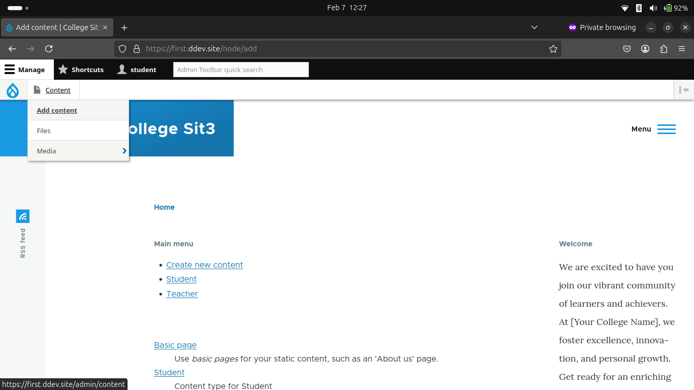
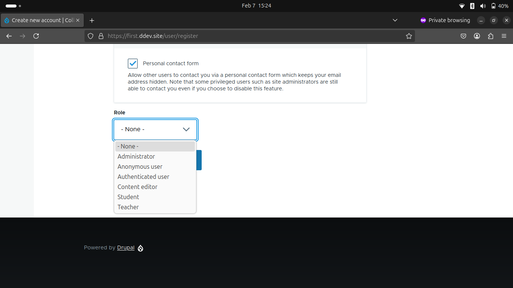
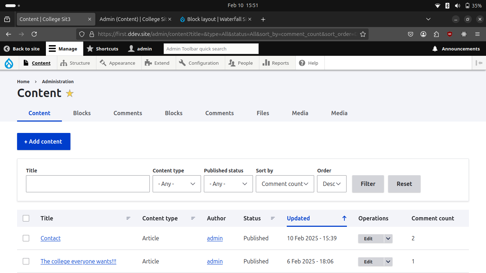
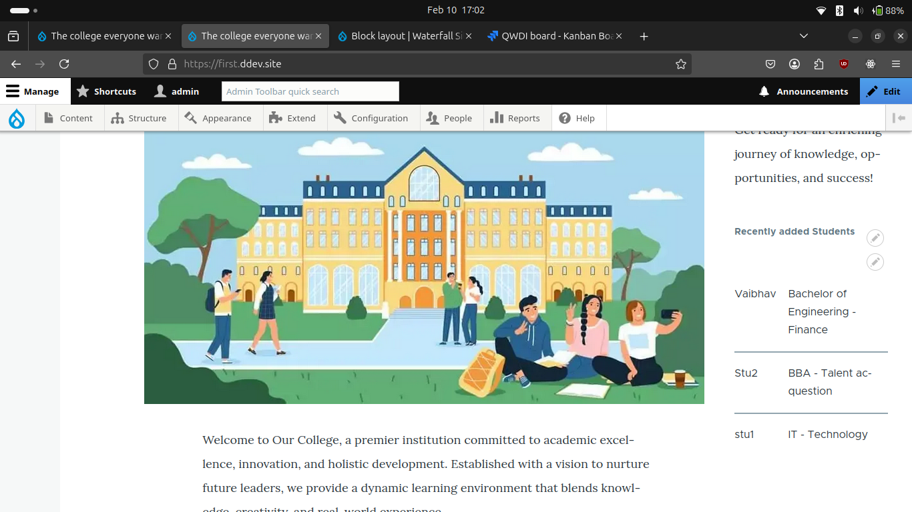
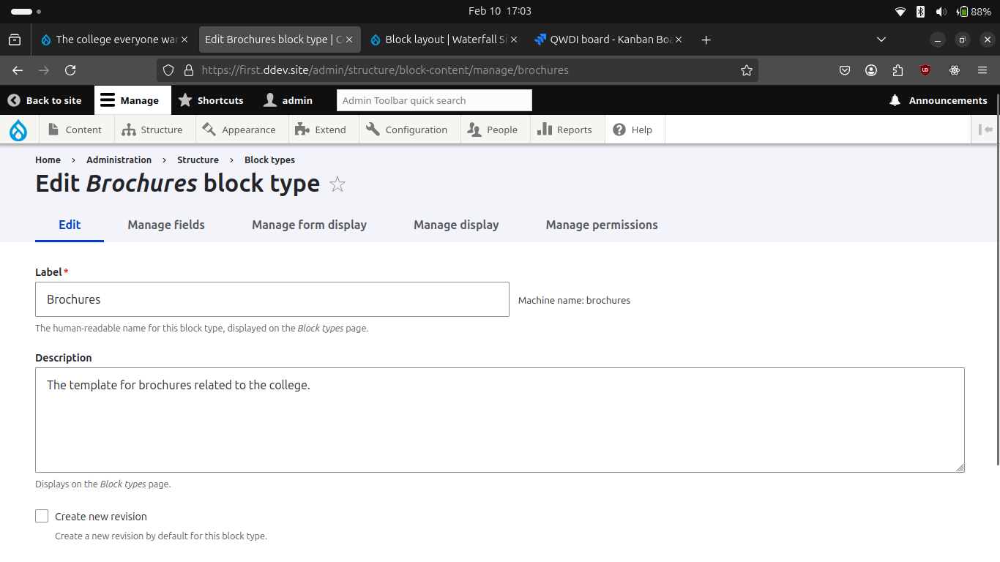
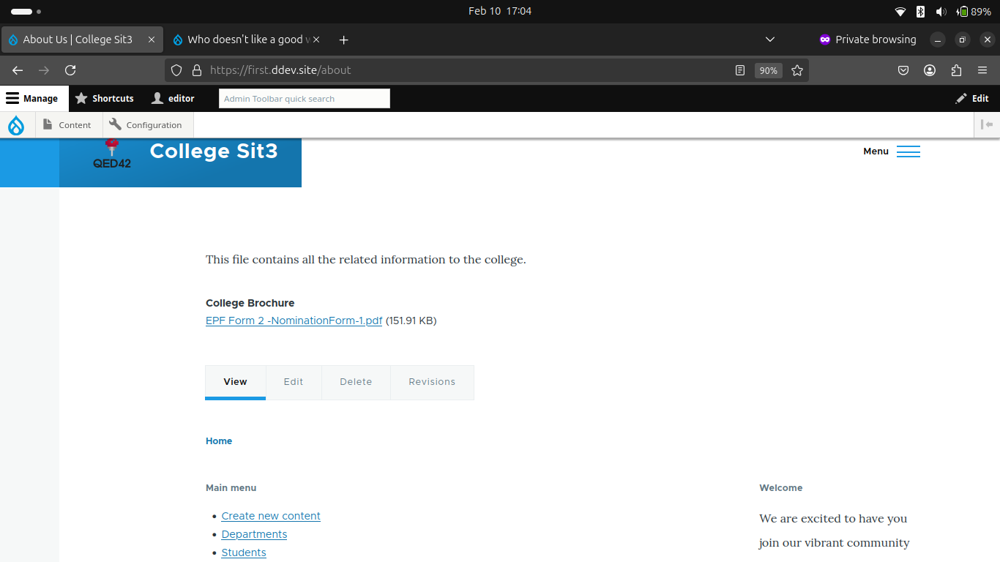
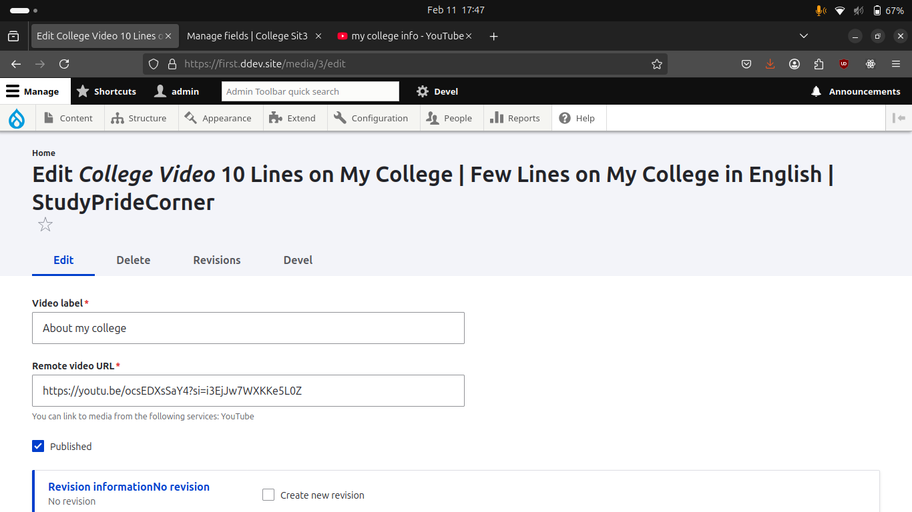
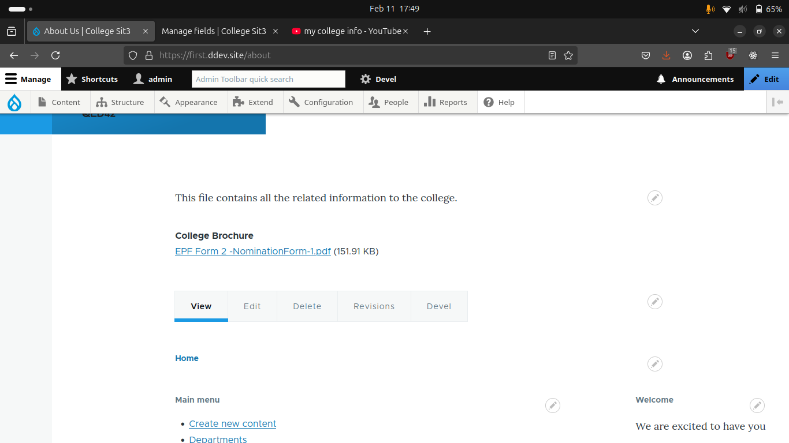
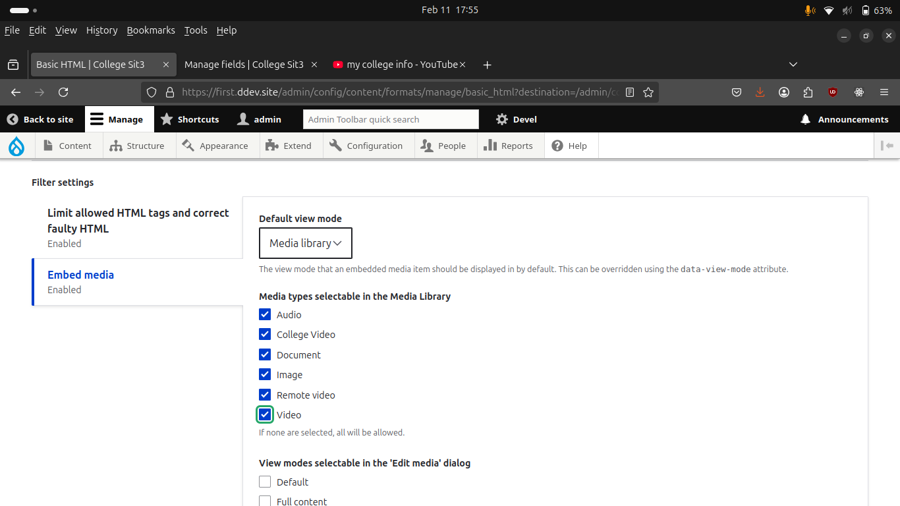
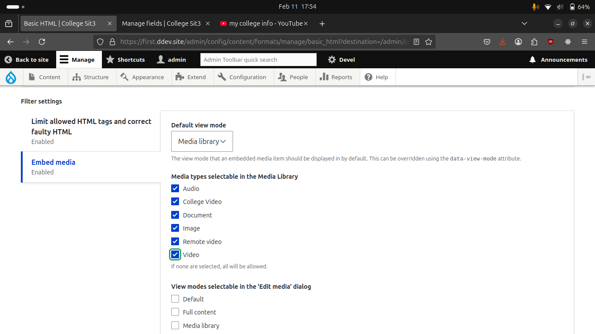

## College Sit3

Created new Drupal project uding Docker, ddev, composer and drush.

### Creating Content Types

If we want to add entities like student, teacher then we have to go to
`Manage > Structure > Content Types`
and then create the contents in below way
<pre>
Name: Teacher
Description: Content type for teacher profiles.
Click Save and Manage Fields.

    Add then add the fields:
        Text (Plain): Name (Label: Teacher Name)
        Image: Profile Picture (Label: Profile Image)
</pre>

Created 3 seperate entities in similar way

1. Teacher
    - Name
    - Profile Picture
    - Biography
    - Specialization
    - Office Hours
    - Social media links
    - Email

2. Student
    - Name
    - Profile Picture
    - Personal Statement
    - Course
    - Year of Study

3. Department
    - Dept Name
    - Dept Description
    - Faculty members *(FK to entity Teacher)*
---

### Creating Taxonomies

Now is time to create Taxonomies

go to
`Manage > Structure > Taxonomy`

To create new Taxonomy click on **Add Vocabulary** button.

Give it name save and terms in it.
like for Department - Engineering, Marketing ,etc.


### Adding Taxonomy Reference Fields to Content Types
Go to Content Type and add new field as 'reference > taxonomy'.
and select created taxonomy from Vocabulary.


### Time to setup permissions.
Go to `manage > people > permissions / roles`
and add permissions as per the requirenments.

### Creating new users

Go to https://first.ddev.site/node/add/student to add new student and so on................


---
---
---

That was it for project related info next part covers what else I learned during the process.


---
<center>

### 6 feb
</center>
<br>

In waterfall project added **taxonomy** for *location* and then changed field from `autocomplete` to `select list` to do so we have to go to **Manage form display**.

Added new difficulty taxonomy which will hold one media image for displaying the difficulty of waterfall for trekking.


In the list of that same taxonomy created 3 terms indicating <b> Easy, Medium </b> and **High** difficulty. <br>
In waterfall **conteny type** created new field to taxonomy reference to that Vocabulary.

Learned abot the extensions named

for the role **Content manager** changed some permissions giving it access to control the media and all the node permissions.

Who can register accounts --- Visitors. Email verificatio uncheck.


---

### What about a bot

- Extend - JSON:API installation.
- Create custom module
- install it.
- add that block on block layout
<center>

**abondaned**

</center>

---


### Exploring permissions

created custom roles for the same. <br>
gave permissions for student n teacher roles.<br>
added create account option for visitors.<br>
added role field in the create account form.<br>

**problem faced 1**
but they cannot access permissions. *solved* -> gave permission to access the content overview option...<br>


**problem faced 2**
Now the role is not properly being assigned to the user while registering from the website itself.

solved -> instead of using user taxonomy used role.

**problem faced 3**

Now everyone can assign admin role themselves we must expose only the Student and Teacher roles to select.



<!--
To fix above
Step 1: Install and Enable the Profile Module

Install the profile module
```sh
ddev composer require drupal/profile
```

Enable the module:
```sh
drush en profile -y
```

Install **Rules** module using
```sh
ddev composer require drupal/rules
```

and enable the same

Navigate to Configuration > Workflow > Rules (`/admin/config/workflow/rules`).

Add new reaction role and set React on event: After saving a new user entity.

Add condition:
'Entity: has field'
-->


#### Creating new custom block

Since the menu has slightly changes now we have to go to
**Structure > Block Types > Add Block Type** to create new template for the blocks.
And now you can add custom blocks in the website.


#### Creating custom URL paths for better SEO
Currenlty we can see the url's as /node/1 and so on to make them custom like title or name of the content
1. Install module named **pathauto**
2. Enable it.
3. Goto `Configuration > Search and Metadata  > URL aliases > Patterns` and create new pattern.
4. Go to bulk crearte on the same page and check **content** and generate.
5. flush all caches.


#### Changing the home page for the admin
Like discussed in the DSM.
Shriaas asked if we can change the Admin content block.

to do so I duplicated the content block from the Views .
And then manipulated it now we have a new option to sort by no of comments.



#### Creating block with Views
Here I've created a <em><b>Recently Added Students list</b></em> to display on the sidebar in the same view as the `Student List`.
And changed some of the fields for the custom block.



Created new custom block type for college brochures. This custom block is only visible on the **About Us** page.




---

#### Media library

1. **Enable and Configure the Media Library Module** <br>
    Go to Extend (/admin/modules).
    Search for Media Library and Media modules.
    Enable both modules and click Install.


2. **To Create new media type**<br>
    Go to Structure → Media types (/admin/structure/media).
    Click Add media type.
    Choose a media type
    Configure settings
    Click Save.

Image of custom media type with **Text label and remote video**


Image of PDF media type displayed on **About us** page `College brochure`


Enabling the media library in WYSIWYG Editor -> CKEditor





#### Creating new Display mode

Go to view modes `/admin/structure/display-modes/view`
In the content section click on **Add view mode for Content**
Now in Student Content type
    - Go to **Manage display** tab
    - Scroll down to bottom and check the newly created view mode.

#### Layout Builder
    Enable the Layout Builder Module
go to the **manage display** section `admin/structure/types/manage/student/display` and check on **Use layout Builder**
<br>Now we can see the manage layout option
Edit your view from various options there.

#### Custom Image Style
GO to **Configuration > Media > Image Styles** create new image Style
Add height and width and add filter **Scale and Crop**.

### Config Management
First I changed the export path from `web/sites/default/settings.php` to `../config` so when I export config files it will be exported to config folder at root directory.

Then I pushed my project with configs to github.


In remote PC
1. Cloned git repo - `git clone https://github.com/sapatevaibhav/drupal-college-site`
2. `cd drupal-college-site/`
3. started ddev container - `ddev start`
4. Installed all dependencies - `ddev composer install`
5. Created root admin - `ddev drush site-install standard --account-name=admin --account-pass=admin --yes`
6. Fetched uuid from the remote config files - `cat config/system.site.yml | grep uuid`
7. Set up current projects UUID from above output - `ddev drush config-set system.site uuid <UUID_HERE> -y`
8. Delete the **Conflicting entities** - `ddev drush entity:delete shortcut && ddev drush entity:delete shortcut_set`
9. Rebuild the cache - `ddev drush cr`
10. Import the config - `ddev drush cim -y`
11. Rebuild cache again - `ddev drush cr`
12. Lauch the project - `ddev drush uli`

---

## Exporting / Importing Database

### Exporting
1. Start the ddev container `ddev start`
2. Export the database `ddev export-db --file=/home/path/to/your/project/folder`

   e.g. **ddev export-db --file=/home/qed42/practice-movie-site/db.sql.gz**

### Importing
1. Start the ddev container
2. Import the database `ddev import ddev import-db --file=path/to/exported/db.sql`

    e.g. **ddev import-db --file=db.sql.gz**
